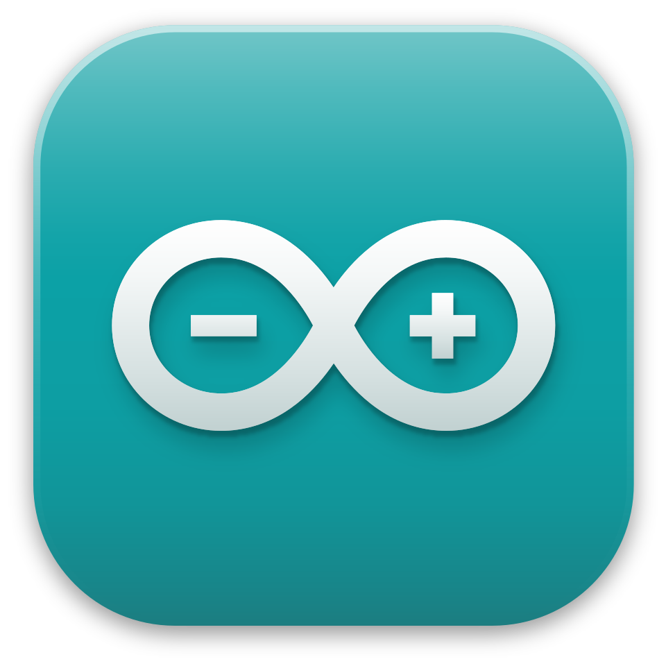
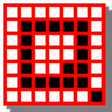
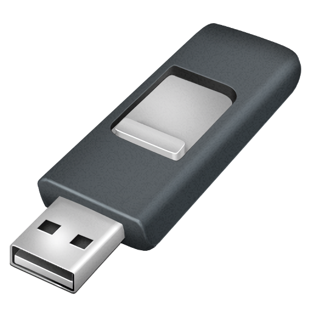
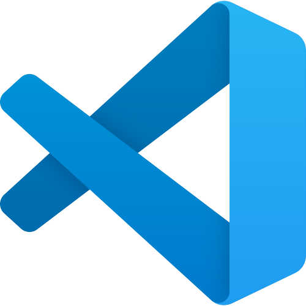
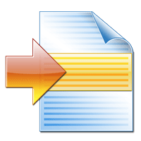

# WC_Devkit

| Install | Description |
| :---: | --- |
| <a href="https://drive.google.com/file/d/1oFD_4hbMgw0aactIzh4DHr9OwputNgMi/view?usp=drive_link"> **Arduino IDE**</a> | Development environment used to write, compile, and upload code to Arduino-compatible microcontroller boards. |
| <a href="https://drive.google.com/file/d/1uf86FxroH-SsYMHptn1awHDlQU0kVeYK/view?usp=drive_link"> **Foxit Reader**</a> | Fast and lightweight PDF viewer and editor. |
| <a href="https://drive.google.com/file/d/1S_8ovFPIsJH_l290ZDBH2dmQahyiWi33/view?usp=drive_link"> **Fritzing**</a> | Electronics design tool used to create circuit diagrams, breadboard layouts, and PCB designs for prototyping projects. |
| <a href="https://drive.google.com/file/d/1MzGAnvRKfB1B7QmG7E3FACY2I0GHo1r5/view?usp=drive_link"> **Q-Dir**</a> | Multi-pane file explorer that lets you view and manage multiple folders simultaneously in a single window. |
| <a href="https://drive.google.com/file/d/1CrSQzOU7Ej3CgI_vUjRRaYVrVd6JdL_u/view?usp=drive_link"> **Rufus**</a> | Utility used to create bootable USB drives from ISO images, format USB storage devices, and prepare OS installation media. |
| <a href="https://drive.google.com/file/d/1gshvX4ZpH6pLW8-v3SkmVaW0IOzm9Xkv/view?usp=drive_link"> **Tree**</a> | Command-line utility that displays the directory structure of a drive or folder in a tree-style format in Windows Terminal. |
| <a href="https://drive.google.com/file/d/1bxd5wYDX_TQIdzSBB0vdvZf3RPd8TM8W/view?usp=drive_link"> **Visual Studio Code**</a> | Lightweight, extensible code editor used for writing, debugging, and managing software projects. |
| <a href="https://drive.google.com/file/d/1nYbH_U0l6g7OkU1ZtU7HSUnt9oQ_WWwe/view?usp=drive_link"> **VMware Workstation**</a> | Desktop virtualization software that lets you run multiple operating systems as virtual machines on a single computer. |
| <a href="https://drive.google.com/file/d/1ehS1WY0Q5fApW8iMgpo4o3105qlBsGtq/view?usp=drive_link"> **WinMerge**</a> | File comparison and merge utility used for validating configuration files, source code changes, and log differences during development and testing. |